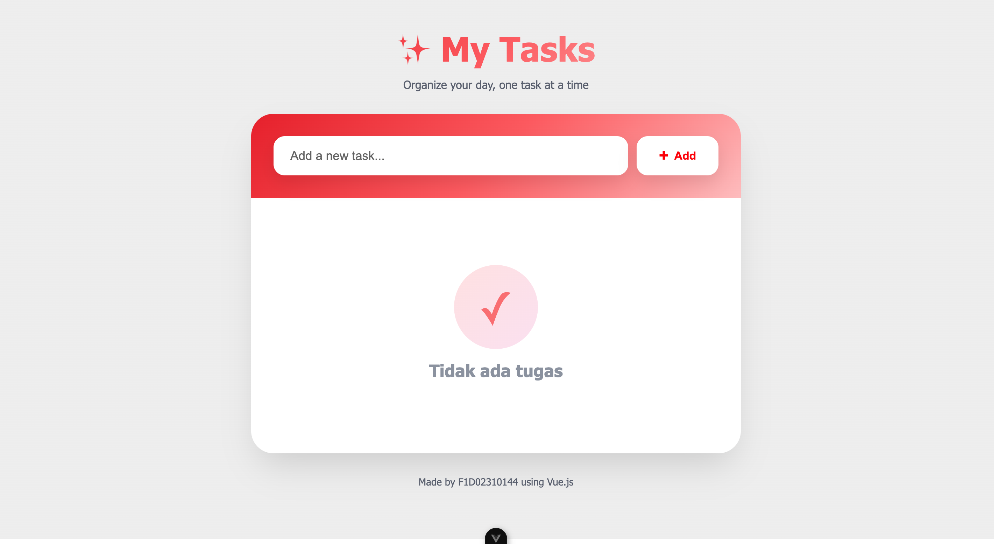
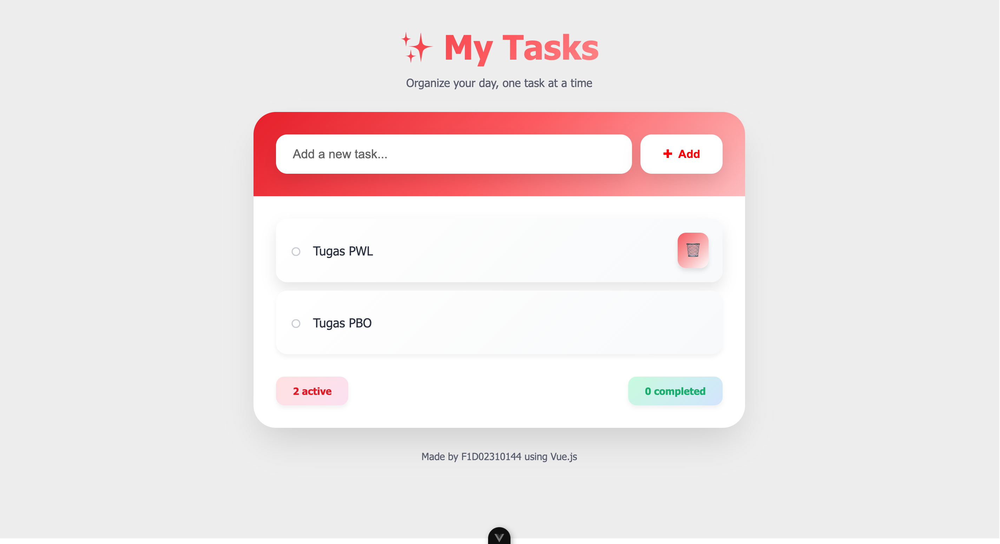
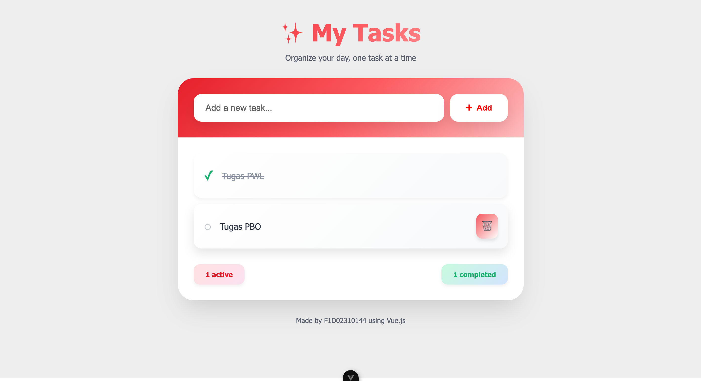

# Assignment: Vue.js – Simple To-Do List

## 📌 Identitas
- **Nama** : [M. Bayu Aji]
- **NIM** : [F1D02310144]

---

## 📖 Deskripsi Tugas
Pada tugas ini saya membuat aplikasi **To-Do List** sederhana menggunakan **Vue.js**.

### ✨ Fitur Aplikasi:
- ✅ Menambah tugas baru
- ❌ Menghapus tugas
- 🔄 Menandai tugas sebagai selesai
- 📊 Menampilkan statistik (active & completed)
- 💬 Menampilkan pesan "Tidak ada tugas" saat daftar kosong
- 🎨 Design modern dengan gradient, shadow, dan animasi

---

## 🎯 Hasil

### 1. Screenshot Hasil Program


*Kondisi saat belum ada tugas*


*Kondisi saat tambah tugas*


*Tampilan dengan beberapa tugas aktif dan completed*

### 2. Penjelasan Kode

#### Reactive State dengan `ref()`
```javascript
const tasks = ref([])
const newTask = ref('')
```
- `tasks`: Array untuk menyimpan daftar tugas
- `newTask`: String untuk input tugas baru

#### Fungsi `addTask()`
```javascript
const addTask = () => {
  if (newTask.value.trim()) {
    tasks.value.push({
      id: Date.now(),
      text: newTask.value,
      completed: false
    })
    newTask.value = ''
  }
}
```
- Mengecek apakah input tidak kosong
- Menambahkan tugas baru ke array `tasks`
- Mereset input field

#### Menampilkan Data dengan `v-for`
```vue
<div v-for="(task, index) in tasks" :key="task.id">
  <!-- Task item -->
</div>
```
- Menggunakan `:key="task.id"` untuk unique identifier
- Loop melalui array `tasks` dan render setiap item

#### Event Handling - Tombol Hapus
```vue
<button @click="deleteTask(index)">🗑</button>
```
```javascript
const deleteTask = (index) => {
  tasks.value.splice(index, 1)
}
```
- Menggunakan `@click` untuk menangani event click
- Menghapus task berdasarkan index

#### Conditional Rendering dengan `v-if`
```vue
<div v-if="tasks.length === 0">
  <p>Tidak ada tugas</p>
</div>
<div v-else>
  <!-- Tasks list -->
</div>
```

#### Two-Way Binding dengan `v-model`
```vue
<input v-model="newTask" type="text" />
```

---

## 🚀 Cara Menjalankan

1. **Install dependencies:**
```bash
npm install
```

2. **Run development server:**
```bash
npm run dev
```

3. **Build untuk production:**
```bash
npm run build
```

---

## 🎨 Design Features

- **Color Palette**: Red gradient
- **Shadows**: Multi-layer shadows untuk depth
- **Rounded Corners**: Border-radius 1-2rem untuk modern look
- **Hover Effects**: Scale transform dan shadow enhancement
- **Animations**: Slide-in animation untuk setiap task item
- **Responsive**: Mobile-friendly design

---

## 📚 Teknologi yang Digunakan

- Vue.js 3 (Composition API)
- CSS3 (Gradients, Shadows, Animations)
- JavaScript ES6+

---


## 🎓 Pembelajaran

Dari tugas ini saya belajar:
1. Konsep **reaktivitas** Vue.js dengan `ref()`
2. **Event handling** dengan `@click` dan `@submit.prevent`
3. **List rendering** dengan `v-for` dan `:key`
4. **Conditional rendering** dengan `v-if` dan `v-else`
5. **Two-way data binding** dengan `v-model`
6. Membuat **UI yang menarik** dengan CSS modern

---
